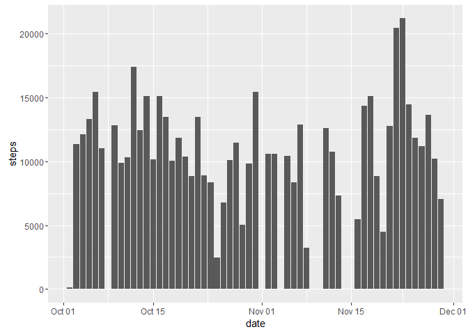
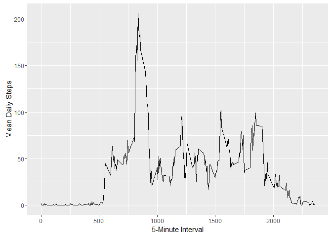
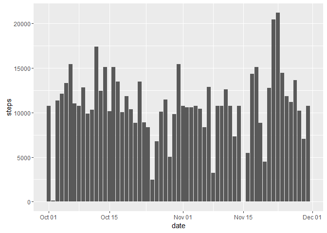
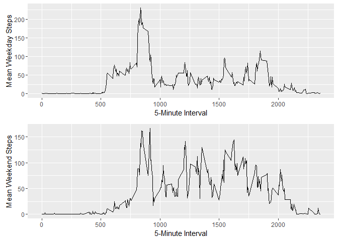

# Reproducible Research: Peer Assessment 1
Kirsten Meeker  
September 17, 2016  

## Loading and preprocessing the data

```r
df = read.csv("activity.csv")
```

## What is mean total number of steps taken per day?

```r
library(ggplot2)
```

```
## Warning: package 'ggplot2' was built under R version 3.2.4
```

```r
#library(scales)

# convert date variable from factor to date format:
df$date <- as.Date(df$date,"%Y-%m-%d")

# graph by day:
ggplot(data = df,
  aes(date, steps)) +
  stat_summary(fun.y = sum, # adds up all observations for the day
    geom = "bar") 
```

```
## Warning: Removed 2304 rows containing non-finite values (stat_summary).
```

<!-- -->

```r
# compute mean and median per day
daily_steps = rowsum(df$steps,df$date,na.rm=TRUE)
mean(daily_steps)
```

```
## [1] 9354.23
```

```r
median(daily_steps)
```

```
## [1] 10395
```


## What is the average daily activity pattern?

```r
library(plyr)
```

```
## Warning: package 'plyr' was built under R version 3.2.5
```

```r
daily_pattern <- ddply(df,~interval, summarise, mean=mean(steps,na.rm=TRUE))

library(ggplot2)
qplot(x=interval, y=mean, data = daily_pattern,  geom = "line",
      xlab="5-Minute Interval",
      ylab="Mean Daily Steps"
      )
```

<!-- -->

```r
# Interval with max mean daily steps
daily_pattern[which.max(daily_pattern$mean), ]
```

```
##     interval     mean
## 104      835 206.1698
```


## Imputing missing values

```r
# number of missing values in data frame
sum(is.na(df))
```

```
## [1] 2304
```

```r
# fill in missing values with mean from daily activity pattern
df_tidy = merge(df,daily_pattern,by="interval")
df_tidy$steps[is.na(df_tidy$steps)] = df_tidy$mean[is.na(df_tidy$steps)]

# graph by day:
ggplot(data = df_tidy,
  aes(date, steps)) +
  stat_summary(fun.y = sum, # adds up all observations for the day
    geom = "bar") 
```

<!-- -->

```r
# compute mean and median per day
daily_steps = rowsum(df_tidy$steps,df_tidy$date)
mean(daily_steps)
```

```
## [1] 10766.19
```

```r
median(daily_steps)
```

```
## [1] 10766.19
```

## Are there differences in activity patterns between weekdays and weekends?

```r
# create new column containing day type
df_tidy$day <- weekdays(as.Date(df_tidy$date))
df_tidy$day[df_tidy$day == "Saturday" | df_tidy$day == "Sunday" ] = "weekend"
df_tidy$day[df_tidy$day == "Monday" | df_tidy$day == "Tuesday" | df_tidy$day == "Wednesday"| df_tidy$day == "Thursday"| df_tidy$day == "Friday"] = "weekday"

# compute daily patterns for 2 day types
library(plyr)
weekday_pattern <- ddply(df_tidy[df_tidy$day=="weekday",],~interval, summarise, mean=mean(steps,na.rm=TRUE))
weekend_pattern <- ddply(df_tidy[df_tidy$day=="weekend",],~interval, summarise, mean=mean(steps,na.rm=TRUE))

# plot weekday and weekend daily means over each other
library(ggplot2)
library(grid)
library(gridExtra)
```

```
## Warning: package 'gridExtra' was built under R version 3.2.5
```

```r
p1 = qplot(x=interval, y=mean, data = weekday_pattern,  geom = "line",
      xlab="5-Minute Interval",
      ylab="Mean Weekday Steps"
      )
p2 = qplot(x=interval, y=mean, data = weekend_pattern,  geom = "line",
      xlab="5-Minute Interval",
      ylab="Mean Weekend Steps"
      )
grid.arrange(p1, p2, nrow = 2)
```

<!-- -->
